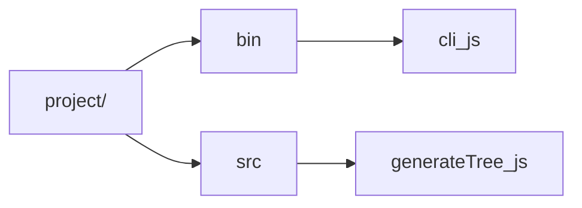

# Baobab Tree Generator

> CLI tool to generate a directory tree (plain-text + Mermaid) of your project

[](https://www.npmjs.com/package/baobab-tree-gen)
[](LICENSE)

---

## Features

- 📂 Recursively lists folders before files  
- 📝 Outputs a human-readable `tree.txt` with inline comments  
- 🌀 Generates a `tree.mmd` Mermaid flowchart file  
- 🚫 Respects your `.gitignore` rules  
- 🔧 Fully customizable via CLI flags  

---

## Installation

```bash
npm install -g baobab-tree-gen
````

Or add to your project:

```bash
npm install --save-dev baobab-tree-gen
```

---

## Quick Start

1. Initialize a Git repo (optional, but `.gitignore` support depends on it):

   ```bash
   git init
   ```
2. Run the generator:

   ```bash
   baobab .
   ```
3. Open `trees/tree.txt` or embed `trees/tree.mmd` in your docs.

---

## Command-Line Usage

See [USAGE.md](USAGE.md) for detailed flags and examples.

---

## Examples

**Text Tree**

```text
project/
├── bin/
│   └── cli.js  # CLI entrypoint
└── src/
    ├── generateTree.js  # Core logic
    └── utils.js
```

**Mermaid Flowchart**



---

## Configuration

By default the tool writes to `./trees`. To change:

```bash
baobab --outputDir docs/structure
```
